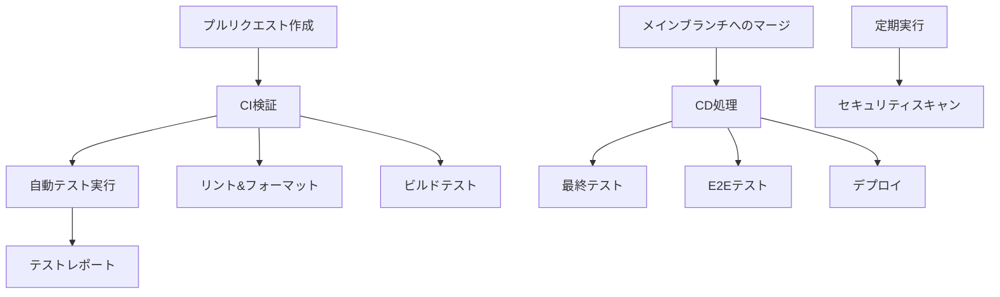

# CI/CD設計サマリー

## パイプラインの流れ

## 主要ワークフロー

1. **Pull Request検証 (ci-pr.yml)**
   - バックエンドGoコードのテストとリント
   - フロントエンドVue/Nuxtコードのテストとリント
   - ビルド検証とアーティファクト生成

2. **デプロイメント (cd-deploy.yml)**
   - メインブランチにマージ後に実行
   - 全テストスイートの実行
   - E2Eテストによる統合検証
   - 本番環境へのデプロイ

3. **コード品質とセキュリティ (code-quality.yml)**
   - セキュリティスキャン (Gosec, Trivy)
   - コード静的解析
   - 脆弱性チェック

## テストカバレッジ

- バックエンド: Go testによるユニットテスト (目標: 80%以上)
- フロントエンド: Vitestによるコンポーネントテスト
- E2E: Playwrightによるブラウザテスト

## アーティファクト

各ビルドステージでは以下のアーティファクトが生成されます:

1. **バックエンドバイナリ**
   - Goアプリケーションのコンパイル済みバイナリ

2. **フロントエンド配布物**
   - Nuxtのビルド結果 (.outputディレクトリ)

3. **Dockerイメージ**
   - 本番用に最適化されたコンテナイメージ

## デプロイ戦略

本番デプロイは以下の流れで行われます:

1. バックエンドとフロントエンドの最終テスト
2. Dockerイメージのビルドと最適化
3. 本番環境へのデプロイ（具体的な方法は環境によって異なる）

## セキュリティ考慮事項

- シークレット情報はGitHub Secretsで管理
- 依存パッケージの脆弱性スキャン
- コンテナイメージのセキュリティチェック
- 定期的なセキュリティ監査
