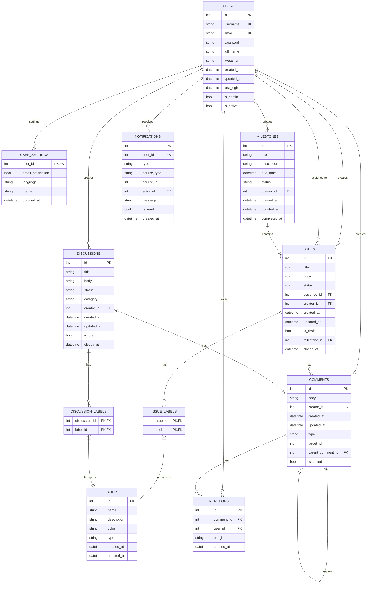

# データベースモデルとマイグレーション設計書

## テーブル設計書

### 1. usersテーブル（ユーザー情報）
| カラム名 | データ型 | NULL | 制約 | 説明 |
|---------|---------|------|------|------|
| id | INTEGER | NOT NULL | PRIMARY KEY, AUTOINCREMENT | ユーザーID |
| username | TEXT | NOT NULL | UNIQUE | ユーザー名 |
| email | TEXT | NOT NULL | UNIQUE | メールアドレス |
| password | TEXT | NOT NULL | | パスワード（ハッシュ化） |
| full_name | TEXT | | | フルネーム |
| avatar_url | TEXT | | | アバター画像URL |
| created_at | TIMESTAMP | NOT NULL | DEFAULT CURRENT_TIMESTAMP | 作成日時 |
| updated_at | TIMESTAMP | NOT NULL | DEFAULT CURRENT_TIMESTAMP | 更新日時 |
| last_login | TIMESTAMP | | | 最終ログイン日時 |
| is_admin | BOOLEAN | NOT NULL | DEFAULT 0 | 管理者フラグ |
| is_active | BOOLEAN | NOT NULL | DEFAULT 1 | アクティブフラグ |

### 2. labelsテーブル（ラベル情報）
| カラム名 | データ型 | NULL | 制約 | 説明 |
|---------|---------|------|------|------|
| id | INTEGER | NOT NULL | PRIMARY KEY, AUTOINCREMENT | ラベルID |
| name | TEXT | NOT NULL | | ラベル名 |
| description | TEXT | | | 説明 |
| color | TEXT | NOT NULL | | 色（HEX形式）|
| type | TEXT | NOT NULL | | タイプ（issue/discussion/both）|
| created_at | TIMESTAMP | NOT NULL | DEFAULT CURRENT_TIMESTAMP | 作成日時 |
| updated_at | TIMESTAMP | NOT NULL | DEFAULT CURRENT_TIMESTAMP | 更新日時 |

※ `name`と`type`の組み合わせで一意制約

### 3. milestonesテーブル（マイルストーン情報）
| カラム名 | データ型 | NULL | 制約 | 説明 |
|---------|---------|------|------|------|
| id | INTEGER | NOT NULL | PRIMARY KEY, AUTOINCREMENT | マイルストーンID |
| title | TEXT | NOT NULL | | タイトル |
| description | TEXT | | | 説明 |
| due_date | TIMESTAMP | | | 期限日 |
| status | TEXT | NOT NULL | | ステータス（open/closed）|
| creator_id | INTEGER | NOT NULL | FOREIGN KEY (users.id) | 作成者ID |
| created_at | TIMESTAMP | NOT NULL | DEFAULT CURRENT_TIMESTAMP | 作成日時 |
| updated_at | TIMESTAMP | NOT NULL | DEFAULT CURRENT_TIMESTAMP | 更新日時 |
| completed_at | TIMESTAMP | | | 完了日時 |

### 4. issuesテーブル（課題情報）
| カラム名 | データ型 | NULL | 制約 | 説明 |
|---------|---------|------|------|------|
| id | INTEGER | NOT NULL | PRIMARY KEY, AUTOINCREMENT | 課題ID |
| title | TEXT | NOT NULL | | タイトル |
| body | TEXT | | | 本文 |
| status | TEXT | NOT NULL | | ステータス（open/closed）|
| assignee_id | INTEGER | | FOREIGN KEY (users.id) | 担当者ID |
| creator_id | INTEGER | NOT NULL | FOREIGN KEY (users.id) | 作成者ID |
| created_at | TIMESTAMP | NOT NULL | DEFAULT CURRENT_TIMESTAMP | 作成日時 |
| updated_at | TIMESTAMP | NOT NULL | DEFAULT CURRENT_TIMESTAMP | 更新日時 |
| is_draft | BOOLEAN | NOT NULL | DEFAULT 0 | 下書きフラグ |
| milestone_id | INTEGER | | FOREIGN KEY (milestones.id) | マイルストーンID |
| closed_at | TIMESTAMP | | | クローズ日時 |

### 5. issue_labelsテーブル（課題ラベル関連）
| カラム名 | データ型 | NULL | 制約 | 説明 |
|---------|---------|------|------|------|
| issue_id | INTEGER | NOT NULL | FOREIGN KEY (issues.id) | 課題ID |
| label_id | INTEGER | NOT NULL | FOREIGN KEY (labels.id) | ラベルID |

※ `issue_id`と`label_id`の組み合わせで主キー

### 6. discussionsテーブル（ディスカッション情報）
| カラム名 | データ型 | NULL | 制約 | 説明 |
|---------|---------|------|------|------|
| id | INTEGER | NOT NULL | PRIMARY KEY, AUTOINCREMENT | ディスカッションID |
| title | TEXT | NOT NULL | | タイトル |
| body | TEXT | | | 本文 |
| status | TEXT | NOT NULL | | ステータス（open/closed/answered）|
| category | TEXT | NOT NULL | | カテゴリ（general/question/announcement など）|
| creator_id | INTEGER | NOT NULL | FOREIGN KEY (users.id) | 作成者ID |
| created_at | TIMESTAMP | NOT NULL | DEFAULT CURRENT_TIMESTAMP | 作成日時 |
| updated_at | TIMESTAMP | NOT NULL | DEFAULT CURRENT_TIMESTAMP | 更新日時 |
| is_draft | BOOLEAN | NOT NULL | DEFAULT 0 | 下書きフラグ |
| closed_at | TIMESTAMP | | | クローズ日時 |

### 7. discussion_labelsテーブル（ディスカッションラベル関連）
| カラム名 | データ型 | NULL | 制約 | 説明 |
|---------|---------|------|------|------|
| discussion_id | INTEGER | NOT NULL | FOREIGN KEY (discussions.id) | ディスカッションID |
| label_id | INTEGER | NOT NULL | FOREIGN KEY (labels.id) | ラベルID |

※ `discussion_id`と`label_id`の組み合わせで主キー

### 8. commentsテーブル（コメント情報）
| カラム名 | データ型 | NULL | 制約 | 説明 |
|---------|---------|------|------|------|
| id | INTEGER | NOT NULL | PRIMARY KEY, AUTOINCREMENT | コメントID |
| body | TEXT | NOT NULL | | 本文 |
| creator_id | INTEGER | NOT NULL | FOREIGN KEY (users.id) | 作成者ID |
| created_at | TIMESTAMP | NOT NULL | DEFAULT CURRENT_TIMESTAMP | 作成日時 |
| updated_at | TIMESTAMP | NOT NULL | DEFAULT CURRENT_TIMESTAMP | 更新日時 |
| type | TEXT | NOT NULL | | コメントタイプ（issue/discussion/reply）|
| target_id | INTEGER | NOT NULL | | 対象ID（IssueまたはDiscussionのID）|
| parent_comment_id | INTEGER | | FOREIGN KEY (comments.id) | 親コメントID（返信の場合）|
| is_edited | BOOLEAN | NOT NULL | DEFAULT 0 | 編集済みフラグ |

### 9. reactionsテーブル（リアクション情報）
| カラム名 | データ型 | NULL | 制約 | 説明 |
|---------|---------|------|------|------|
| id | INTEGER | NOT NULL | PRIMARY KEY, AUTOINCREMENT | リアクションID |
| comment_id | INTEGER | NOT NULL | FOREIGN KEY (comments.id) | コメントID |
| user_id | INTEGER | NOT NULL | FOREIGN KEY (users.id) | ユーザーID |
| emoji | TEXT | NOT NULL | | 絵文字コード |
| created_at | TIMESTAMP | NOT NULL | DEFAULT CURRENT_TIMESTAMP | 作成日時 |

※ `comment_id`, `user_id`, `emoji`の組み合わせで一意制約

### 10. notificationsテーブル（通知情報）
| カラム名 | データ型 | NULL | 制約 | 説明 |
|---------|---------|------|------|------|
| id | INTEGER | NOT NULL | PRIMARY KEY, AUTOINCREMENT | 通知ID |
| user_id | INTEGER | NOT NULL | FOREIGN KEY (users.id) | 通知先ユーザーID |
| type | TEXT | NOT NULL | | 通知タイプ（mention/assign/comment/etc）|
| source_type | TEXT | NOT NULL | | 通知元タイプ（issue/discussion/comment）|
| source_id | INTEGER | NOT NULL | | 通知元ID |
| actor_id | INTEGER | NOT NULL | FOREIGN KEY (users.id) | アクションしたユーザーID |
| message | TEXT | NOT NULL | | 通知メッセージ |
| is_read | BOOLEAN | NOT NULL | DEFAULT 0 | 既読フラグ |
| created_at | TIMESTAMP | NOT NULL | DEFAULT CURRENT_TIMESTAMP | 作成日時 |

### 11. user_settingsテーブル（ユーザー設定）
| カラム名 | データ型 | NULL | 制約 | 説明 |
|---------|---------|------|------|------|
| user_id | INTEGER | NOT NULL | PRIMARY KEY, FOREIGN KEY (users.id) | ユーザーID |
| email_notification | BOOLEAN | NOT NULL | DEFAULT 1 | メール通知設定 |
| language | TEXT | NOT NULL | DEFAULT 'en' | 言語設定（en/ja）|
| theme | TEXT | NOT NULL | DEFAULT 'light' | テーマ設定 |
| updated_at | TIMESTAMP | NOT NULL | DEFAULT CURRENT_TIMESTAMP | 更新日時 |

## ER図



## 全文検索（FTS）設計

### SQLiteでの実装
SQLiteでは、FTS5仮想テーブルを使用して以下のテーブルを作成します：

1. `issues_fts`: 課題の全文検索用（タイトルと本文を対象）
   ```sql
   CREATE VIRTUAL TABLE issues_fts USING fts5(
       title, 
       body, 
       content='issues', 
       content_rowid='id'
   );
   ```

2. `discussions_fts`: ディスカッションの全文検索用
   ```sql
   CREATE VIRTUAL TABLE discussions_fts USING fts5(
       title, 
       body, 
       content='discussions', 
       content_rowid='id'
   );
   ```

3. `comments_fts`: コメントの全文検索用
   ```sql
   CREATE VIRTUAL TABLE comments_fts USING fts5(
       body, 
       content='comments', 
       content_rowid='id'
   );
   ```

各FTSテーブルに対して、トリガーを設定してCRUD操作時に自動的に更新されるようにします。

### PostgreSQLでの実装
PostgreSQLでは、tsvector型とGINインデックスを使用します：

1. issues テーブルの全文検索カラムとインデックス
   ```sql
   ALTER TABLE issues ADD COLUMN search_vector tsvector;
   CREATE INDEX issues_search_idx ON issues USING gin(search_vector);
   
   CREATE FUNCTION issues_search_trigger() RETURNS trigger AS $$
   BEGIN
       NEW.search_vector := 
           setweight(to_tsvector('japanese', COALESCE(NEW.title, '')), 'A') ||
           setweight(to_tsvector('japanese', COALESCE(NEW.body, '')), 'B');
       RETURN NEW;
   END
   $$ LANGUAGE plpgsql;

   CREATE TRIGGER issues_search_update
       BEFORE INSERT OR UPDATE ON issues
       FOR EACH ROW EXECUTE FUNCTION issues_search_trigger();
   ```

他のテーブルについても同様に実装します。

## マイグレーション管理

### マイグレーション方針

1. **ツール選定**
   - `golang-migrate/migrate` パッケージを使用
   - バージョン管理用のテーブルで移行状態を管理

2. **抽象化レイヤー**
   - リポジトリパターンに基づくDB抽象化層を実装
   - 各DBタイプ（SQLite/PostgreSQL）に対応するインターフェース実装

3. **開発プロセス**
   - スキーマ変更はマイグレーションで行う
   - 開発環境では自動マイグレーションを設定
   - 本番環境では明示的にマイグレーションを実行

### マイグレーションファイル構成

```
backend/
  └── migrations/
      ├── migrate.go
      ├── sqlite/
      │   ├── 000001_create_users_table.up.sql
      │   ├── 000001_create_users_table.down.sql
      │   ├── 000002_create_user_settings_table.up.sql
      │   ├── 000002_create_user_settings_table.down.sql
      │   ├── 000003_create_labels_table.up.sql
      │   ├── 000003_create_labels_table.down.sql
      │   ├── 000004_create_milestones_table.up.sql
      │   ├── 000004_create_milestones_table.down.sql
      │   ├── 000005_create_issues_table.up.sql
      │   ├── 000005_create_issues_table.down.sql
      │   ├── 000006_create_issue_labels_table.up.sql
      │   ├── 000006_create_issue_labels_table.down.sql
      │   ├── 000007_create_discussions_table.up.sql
      │   ├── 000007_create_discussions_table.down.sql
      │   ├── 000008_create_discussion_labels_table.up.sql
      │   ├── 000008_create_discussion_labels_table.down.sql
      │   ├── 000009_create_comments_table.up.sql
      │   ├── 000009_create_comments_table.down.sql
      │   ├── 000010_create_reactions_table.up.sql
      │   ├── 000010_create_reactions_table.down.sql
      │   ├── 000011_create_notifications_table.up.sql
      │   └── 000011_create_notifications_table.down.sql
      └── postgres/
          ├── 000001_create_users_table.up.sql
          ├── 000001_create_users_table.down.sql
          └── ... (今後追加予定)
```

## Go モデル実装

各テーブルに対応するGoの構造体を以下のように定義します：

```go
// User モデル
type User struct {
	ID        int64     `json:"id"`
	Username  string    `json:"username"`
	Email     string    `json:"email"`
	Password  string    `json:"-"` // レスポンスには含めない
	FullName  string    `json:"full_name"`
	AvatarURL string    `json:"avatar_url"`
	CreatedAt time.Time `json:"created_at"`
	UpdatedAt time.Time `json:"updated_at"`
	LastLogin time.Time `json:"last_login"`
	IsAdmin   bool      `json:"is_admin"`
	IsActive  bool      `json:"is_active"`
}

// UserSettings モデル
type UserSettings struct {
	UserID            int64     `json:"user_id"`
	EmailNotification bool      `json:"email_notification"`
	Language          string    `json:"language"`
	Theme             string    `json:"theme"`
	UpdatedAt         time.Time `json:"updated_at"`
}

// Label モデル
type Label struct {
	ID          int64     `json:"id"`
	Name        string    `json:"name"`
	Description string    `json:"description"`
	Color       string    `json:"color"`
	Type        string    `json:"type"` // issue/discussion/both
	CreatedAt   time.Time `json:"created_at"`
	UpdatedAt   time.Time `json:"updated_at"`
}

// Milestone モデル
type Milestone struct {
	ID          int64     `json:"id"`
	Title       string    `json:"title"`
	Description string    `json:"description"`
	DueDate     time.Time `json:"due_date"`
	Status      string    `json:"status"` // open/closed
	CreatorID   int64     `json:"creator_id"`
	CreatedAt   time.Time `json:"created_at"`
	UpdatedAt   time.Time `json:"updated_at"`
	CompletedAt time.Time `json:"completed_at"`
}

// Issue モデル
type Issue struct {
	ID          int64     `json:"id"`
	Title       string    `json:"title"`
	Body        string    `json:"body"`
	Status      string    `json:"status"` // open/closed
	AssigneeID  int64     `json:"assignee_id,omitempty"`
	CreatorID   int64     `json:"creator_id"`
	CreatedAt   time.Time `json:"created_at"`
	UpdatedAt   time.Time `json:"updated_at"`
	IsDraft     bool      `json:"is_draft"`
	MilestoneID int64     `json:"milestone_id,omitempty"`
	ClosedAt    time.Time `json:"closed_at,omitempty"`
	Labels      []Label   `json:"labels,omitempty"` // 関連するラベル
}

// Discussion モデル
type Discussion struct {
	ID        int64     `json:"id"`
	Title     string    `json:"title"`
	Body      string    `json:"body"`
	Status    string    `json:"status"` // open/closed/answered
	Category  string    `json:"category"` // general/question/announcement
	CreatorID int64     `json:"creator_id"`
	CreatedAt time.Time `json:"created_at"`
	UpdatedAt time.Time `json:"updated_at"`
	IsDraft   bool      `json:"is_draft"`
	ClosedAt  time.Time `json:"closed_at,omitempty"`
	Labels    []Label   `json:"labels,omitempty"` // 関連するラベル
}

// Comment モデル
type Comment struct {
	ID              int64     `json:"id"`
	Body            string    `json:"body"`
	CreatorID       int64     `json:"creator_id"`
	CreatedAt       time.Time `json:"created_at"`
	UpdatedAt       time.Time `json:"updated_at"`
	Type            string    `json:"type"` // issue/discussion/reply
	TargetID        int64     `json:"target_id"`
	ParentCommentID int64     `json:"parent_comment_id,omitempty"`
	IsEdited        bool      `json:"is_edited"`
	Reactions       []Reaction `json:"reactions,omitempty"` // 関連するリアクション
}

// Reaction モデル
type Reaction struct {
	ID        int64     `json:"id"`
	CommentID int64     `json:"comment_id"`
	UserID    int64     `json:"user_id"`
	Emoji     string    `json:"emoji"`
	CreatedAt time.Time `json:"created_at"`
}

// Notification モデル
type Notification struct {
	ID         int64     `json:"id"`
	UserID     int64     `json:"user_id"`
	Type       string    `json:"type"` // mention/assign/comment/etc
	SourceType string    `json:"source_type"` // issue/discussion/comment
	SourceID   int64     `json:"source_id"`
	ActorID    int64     `json:"actor_id"`
	Message    string    `json:"message"`
	IsRead     bool      `json:"is_read"`
	CreatedAt  time.Time `json:"created_at"`
}
```

## リポジトリインターフェース

データベース操作を抽象化するリポジトリインターフェースを以下のように定義します：

```go
// UserRepository はユーザー関連のデータベース操作を抽象化するインターフェース
type UserRepository interface {
	Create(ctx context.Context, user *models.User) error
	GetByID(ctx context.Context, id int64) (*models.User, error)
	GetByUsername(ctx context.Context, username string) (*models.User, error)
	GetByEmail(ctx context.Context, email string) (*models.User, error)
	List(ctx context.Context, page, limit int) ([]*models.User, int, error)
	Update(ctx context.Context, user *models.User) error
	Delete(ctx context.Context, id int64) error
}

// LabelRepository はラベル関連のデータベース操作を抽象化するインターフェース
type LabelRepository interface {
	Create(ctx context.Context, label *models.Label) error
	GetByID(ctx context.Context, id int64) (*models.Label, error)
	List(ctx context.Context, filter map[string]interface{}) ([]*models.Label, error)
	Update(ctx context.Context, label *models.Label) error
	Delete(ctx context.Context, id int64) error
}

// MilestoneRepository はマイルストーン関連のデータベース操作を抽象化するインターフェース
type MilestoneRepository interface {
	Create(ctx context.Context, milestone *models.Milestone) error
	GetByID(ctx context.Context, id int64) (*models.Milestone, error)
	List(ctx context.Context, filter map[string]interface{}, page, limit int) ([]*models.Milestone, int, error)
	Update(ctx context.Context, milestone *models.Milestone) error
	Delete(ctx context.Context, id int64) error
}

// IssueRepository はIssue関連のデータベース操作を抽象化するインターフェース
type IssueRepository interface {
	Create(ctx context.Context, issue *models.Issue) error
	GetByID(ctx context.Context, id int64) (*models.Issue, error)
	List(ctx context.Context, filter map[string]interface{}, page, limit int) ([]*models.Issue, int, error)
	Update(ctx context.Context, issue *models.Issue) error
	Delete(ctx context.Context, id int64) error
	Search(ctx context.Context, query string, page, limit int) ([]*models.Issue, int, error)
	AddLabel(ctx context.Context, issueID, labelID int64) error
	RemoveLabel(ctx context.Context, issueID, labelID int64) error
	GetLabels(ctx context.Context, issueID int64) ([]*models.Label, error)
}

// CommentRepository はコメント関連のデータベース操作を抽象化するインターフェース
type CommentRepository interface {
	Create(ctx context.Context, comment *models.Comment) error
	GetByID(ctx context.Context, id int64) (*models.Comment, error)
	ListByTarget(ctx context.Context, targetType string, targetID int64, page, limit int) ([]*models.Comment, int, error)
	Update(ctx context.Context, comment *models.Comment) error
	Delete(ctx context.Context, id int64) error
	Search(ctx context.Context, query string, page, limit int) ([]*models.Comment, int, error)
}

// DiscussionRepository はディスカッション関連のデータベース操作を抽象化するインターフェース
type DiscussionRepository interface {
	Create(ctx context.Context, discussion *models.Discussion) error
	GetByID(ctx context.Context, id int64) (*models.Discussion, error)
	List(ctx context.Context, filter map[string]interface{}, page, limit int) ([]*models.Discussion, int, error)
	Update(ctx context.Context, discussion *models.Discussion) error
	Delete(ctx context.Context, id int64) error
	Search(ctx context.Context, query string, page, limit int) ([]*models.Discussion, int, error)
	AddLabel(ctx context.Context, discussionID, labelID int64) error
	RemoveLabel(ctx context.Context, discussionID, labelID int64) error
	GetLabels(ctx context.Context, discussionID int64) ([]*models.Label, error)
}

// NotificationRepository は通知関連のデータベース操作を抽象化するインターフェース
type NotificationRepository interface {
	Create(ctx context.Context, notification *models.Notification) error
	GetByID(ctx context.Context, id int64) (*models.Notification, error)
	ListByUser(ctx context.Context, userID int64, isRead bool, page, limit int) ([]*models.Notification, int, error)
	MarkAsRead(ctx context.Context, id int64) error
	MarkAllAsRead(ctx context.Context, userID int64) error
	Delete(ctx context.Context, id int64) error
}
```

## デモデータ生成

開発環境でのテスト用に、シードデータを投入する機能を実装します。

```go
// シードデータ構造
type Seeder struct {
	userRepo        repositories.UserRepository
	issueRepo       repositories.IssueRepository
	labelRepo       repositories.LabelRepository
	milestoneRepo   repositories.MilestoneRepository
	discussionRepo  repositories.DiscussionRepository
	commentRepo     repositories.CommentRepository
}

// シードデータを投入
func (s *Seeder) Seed(ctx context.Context) error {
	// ユーザーデータ作成
	users, err := s.seedUsers(ctx)
	if err != nil {
		return err
	}
	
	// ラベルデータ作成
	labels, err := s.seedLabels(ctx)
	if err != nil {
		return err
	}
	
	// マイルストーンデータ作成
	milestones, err := s.seedMilestones(ctx, users[0].ID)
	if err != nil {
		return err
	}
	
	// Issueデータ作成
	issues, err := s.seedIssues(ctx, users, labels, milestones)
	if err != nil {
		return err
	}
	
	// Discussionデータ作成
	discussions, err := s.seedDiscussions(ctx, users, labels)
	if err != nil {
		return err
	}
	
	// コメントデータ作成
	err = s.seedComments(ctx, users, issues, discussions)
	if err != nil {
		return err
	}
	
	return nil
}
```

## 今後の展開

1. **マイグレーションCLIコマンドの実装**
   - マイグレーションの実行、ロールバック、確認用のコマンド
   - スキーマ自動生成機能

2. **データ移行ツール**
   - SQLiteからPostgreSQLへのデータ移行スクリプト
   - バックアップ・リストア機能

3. **パフォーマンス最適化**
   - インデックス追加
   - クエリ最適化
   - キャッシュ戦略

4. **監視と保守**
   - データベース状態監視
   - エラーログ収集
   - パフォーマンス指標の収集
