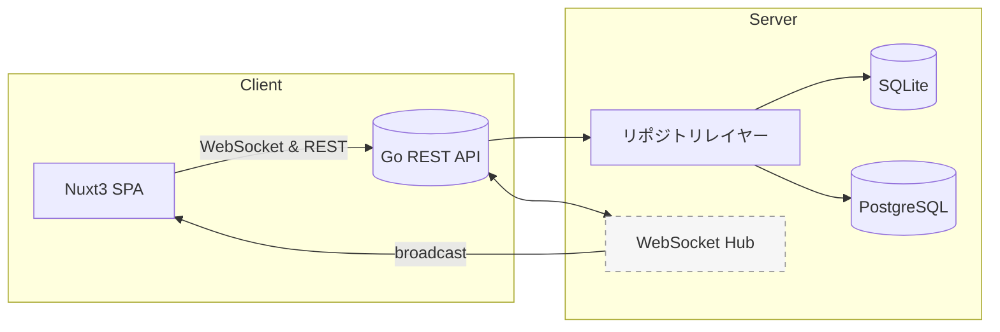

## プロジェクト概要書 — “軽量 GitHub-ライク チケット管理システム”

### 1. 目的

* **GitHub Issue / Discussion の操作感**をそのままに、
  小〜中規模チームでも自前でホストできる“軽量・リアルタイム”なチケット管理ツールを提供する。
* SaaS 版にも展開できる設計

### 2. MVP

| ゴール              | 測定基準                                 |
| ---------------- | ------------------------------------ |
| ① GitHub ライクな UI | 新規ユーザーが 5 分以内に基本操作（Issue 作成／コメント） |
| ② リアルタイム反映       | コメント投稿から UI 反映まで ≤ 300 ms            |
| ③ シンプル導入         | `docker compose up` 1 コマンドで起動        |

### 3. スコープ

| カテゴリ       | **MVP に含める**                     | **今回は含めない（将来拡張）** |
| ---------- | -------------------------------- | ----------------- |
| 認証         | E-mail & Password | SSO / RBAC        |
| Issue      | CRUD, Markdown, ラベル・アサイン         | プルリク型レビュー機能       |
| Discussion | スレッド化コメント                        | Poll／Q\&A モード     |
| 通知         | ブラウザ Push／E-mail                 | BOT 連携  |
| 検索         | フルテキスト（DB抽象化レイヤー使用）        | 高度検索 DSL          |
| 多言語        | 英語・日本語 UI                        | i18n 追加言語         |

### 4. 技術スタック

| レイヤ      | 採用技術                           | メモ                                 |
| -------- | ------------------------------ | ---------------------------------- |
| フロントエンド  | **Nuxt 3 (Vue 3 + Vite)**      | Composition API, Pinia, SSRオフ（SPA） |
| リアルタイム通信 | **WebSocket (SockJS + STOMP)** | シンプル・双方向                           |
| バックエンド   | **Go 1.22 / Gin**              | gRPC-readyなサービス層を意識                |
| 永続化      | **SQLite 3 + PostgreSQL**      | 抽象化レイヤー実装済、環境変数で切替可能           |
| キャッシュ    | **Redis (オプション)**              | Pub/Sub + セッション                    |
| コンテナ/CI  | Docker, GitHub Actions         | `go test`, `nuxt build`, lint, e2e |

### 5. ハイレベルアーキテクチャ

### 6. 主要機能一覧

| 機能                      | 詳細                                  |
| ----------------------- | ----------------------------------- |
| Issue / Discussion CRUD | タイトル／本文 (Markdown + Preview)、ドラフト保存 |
| ラベル／マイルストーン／アサイン        | GitHub 同等 UX、色選択 UI                 |
| コメント（スレッド対応）            | いいね / リアクション絵文字                     |
| Mention & Auto-complete | `@username` と `#issue` 補完           |
| リアルタイム更新                | WebSocket push（新規/更新/削除を即時配信）       |
| 通知センター                  | in-app + E-mail (SendGrid stub)     |
| 検索バー                    | タイトル＋本文全文検索、ラベル・担当者フィルタ             |
| 設定画面                    | 個人プロフィール、E-mail 通知 ON/OFF           |
| 管理者ダッシュボード              | ユーザー・Repo 管理、データベース設定・管理         |

### 7. 非機能要件

| 項目      | 目標値                                |
| ------- | ---------------------------------- |
| パフォーマンス | 同時 500 接続でレスポンス p95 ≤ 200 ms       |
| 可搬性     | x86/ARM（Raspberry Pi 含む）でビルド成功     |
| セキュリティ  | OWASP Top-10 対策（CSRF, XSS, SQLi 等） |
| テスト     | ユニット 80% / E2E 20 シナリオ             |

### 9. リスク & 対策

| リスク            | 対策                               |
| -------------- | -------------------------------- |
| WebSocket スケール | Redis Pub/Sub で Hub 水平分割         |
| データベース互換性    | リポジトリパターンによる抽象化、DB固有機能のフォールバック実装 |
| UI 誤差          | GitHub コンポーネントを意識し Storybook で共有 |

---

**Next Step**

* 要件レビュー → 1 週間でプロトタイプ API & Nuxt ページ骨組み作成
* Storybook で UI モックを共有し、操作感を早期に確定させる
